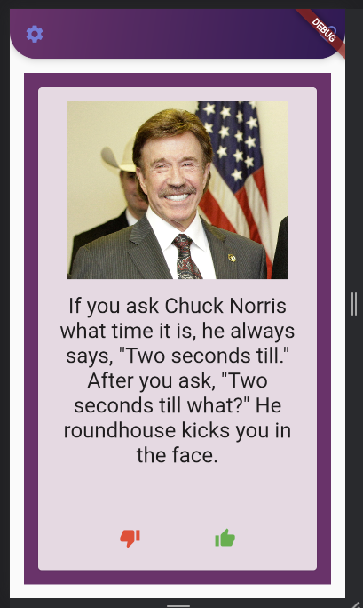

# Chuck Norris Jokes Swiper

## Description

Joke Swipe is a mobile app that allows users to swipe through jokes and rate them as either "liked" or "disliked”

The application has three screens:

1. Main Screen with joke card

1. Screen with favorite jokes

1. Creator info screen

## Technologies Used

- Dart programming language
- Flutter mobile app development framework
- Chuck Noris Joke API for retrieving random jokes
- Web Search API for retrieving images with Chuck Norris

**NOTE: I did not find API without restrictions, so the application may not work correctly after a certain time, since only 100 requests per day are available for my key**

## Features:

- Cards can be swiped

  

- There is a dialog box with information about me (see screens)
- Each card has a picture of Chuck Noris

## APK:
https://github.com/RakaVaqaFlow/Chuck-Norris-Jokes-Swiper/blob/main/app-release.apk
